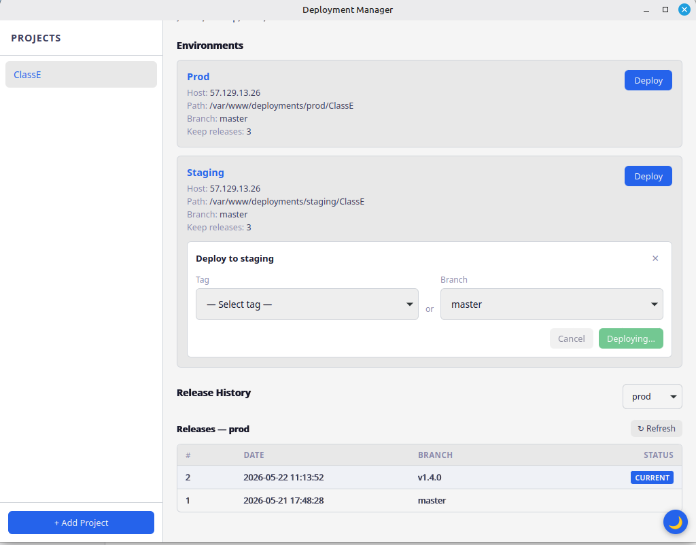

# Deployment Manager

A lightweight desktop application for managing [PHP Deployer](https://deployer.org/) deployments across multiple projects.

Register your projects, see their environments, deploy with a click, and track release history — all from one interface.

## Features

- Manage deployments for multiple projects from a single app
- Auto-discovers environments from each project's `hosts.yaml`
- Quick deploy with tag or branch selection
- View deployment output after completion
- Release history per environment
- Light and dark theme
- Cross-platform: Linux (primary), macOS (planned)




## Installation

### Prerequisites

- **PHP Deployer** (`dep`) installed and available in PATH
- **Git** installed (for tag/branch discovery)

### Download

Download the latest release from the [Releases](../../releases) page.

- **Linux**: `.deb` package or standalone binary

### Build from source

See [CONTRIBUTING.md](CONTRIBUTING.md) for build instructions.

## Getting Started

### 1. Prepare your project

Each project you want to manage needs a `.deployments/` directory containing:

- **`deploy.php`** — Your PHP Deployer recipe
- **`hosts.yaml`** — Host configuration defining your environments

### 2. Register a project

Click "+ Add Project" in the sidebar and enter the absolute path to your project root (the directory containing `.deployments/`).

### 3. Deploy

1. Select your project in the sidebar
2. Click "Deploy" on the environment you want to deploy to
3. Select a tag or branch
4. Hit Deploy

The deployment output appears after the process completes.

## hosts.yaml format

The app reads your existing PHP Deployer hosts configuration. Both formats are supported:

```yaml
hosts:
  prod:
    hostname: server.example.com
    remote_user: deploy
    deploy_path: /var/www/app
    branch: master
    keep_releases: 5
    stage: prod
  staging:
    hostname: server.example.com
    remote_user: deploy
    deploy_path: /var/www/staging
    branch: develop
    keep_releases: 3
    stage: staging
```

| Field | Required | Description |
|-------|----------|-------------|
| `hostname` | yes | Server hostname or IP |
| `remote_user` | yes | SSH user for deployment |
| `deploy_path` | yes | Remote path for deployments |
| `branch` | no | Default branch for this environment |
| `stage` | no | Stage identifier (e.g., "prod", "staging") |
| `keep_releases` | no | Number of recent releases to show in the app (default: 5) |

## CLI Commands

Under the hood, the app executes these `dep` commands:

```bash
# Deploy
dep deploy -f .deployments/deploy.php <environment>
dep deploy -f .deployments/deploy.php <environment> --tag=<tag>
dep deploy -f .deployments/deploy.php <environment> --branch=<branch>

# Fetch release history
dep -f .deployments/deploy.php releases <environment>
```

## Data Storage

| What | Where (Linux) |
|------|---------------|
| Registered projects | `~/.config/deployment-manager/config.json` |
| Logs | `~/.local/share/com.deployment-manager.app/logs/` |
| UI preferences (theme) | WebView localStorage in `~/.local/share/com.deployment-manager.app/` |

On macOS, config is stored in `~/Library/Application Support/deployment-manager/config.json`.

## Tips

- **Theme**: Click the ☀/🌙 button in the bottom-right corner to switch between light and dark mode
- **Release history**: Shows the most recent releases based on `keep_releases` in your hosts.yaml (defaults to 5)
- **Environments**: Displayed in alphabetical order for consistency across sessions
- **Logs**: Check the log directory if something isn't working — environment discovery and deployment errors are logged there

## License

MIT — see [LICENCE](LICENCE)
